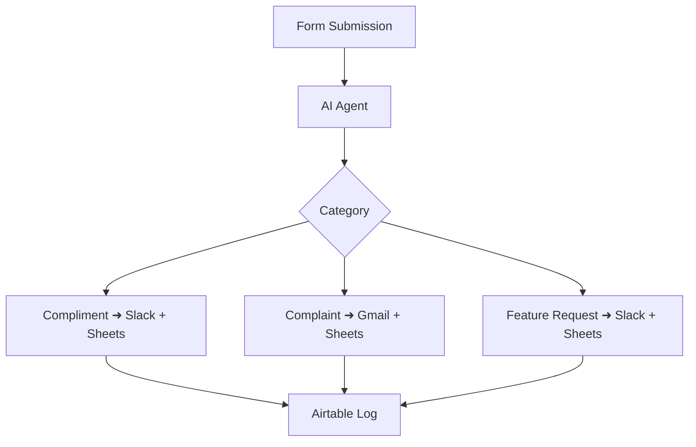

# 🤖 Customer Feedback AI Agent (Built with n8n)

This AI-powered automation workflow classifies and routes customer feedback in real-time using n8n. It enables faster responses, smarter organization, and better decision-making — all without manual effort.

---

## 🚀 What It Does

- Accepts customer feedback via a form trigger
- Uses an AI Agent to classify input as:
  - ✅ Compliment
  - ❗ Complaint
  - 💡 Feature Request
- Based on the classification:
  - Sends compliments and requests to relevant communication channels
  - Automatically replies to complaints with a preset email
  - Stores each item in categorized **Google Sheets** (or **Airtable** as an alternative)
  - Logs all entries centrally in **Airtable**

---

## 🛠️ Tools Used

| Platform       | Purpose                                   |
|----------------|-------------------------------------------|
| `n8n`          | Workflow automation & orchestration       |
| `AI Agent`     | Feedback classification                   |
| `Slack`        | Internal team notifications               |
| `Gmail`        | Automated customer responses              |
| `Google Sheets`| Data storage (can be replaced with Airtable)|
| `Airtable`     | Centralized feedback archive (optional)   |

---

## 🧠 Workflow Diagram

---
## 📁 Included Files

| File / Folder     | Description                                              |
|-------------------|----------------------------------------------------------|
| `workflow.json`   | Ready-to-import n8n workflow file                        |
| `/assets/`        | Folder for screenshots or workflow diagrams (optional)  |
| `README.md`       | This documentation file                                  |

---

## 💼 Use Cases

- SaaS or service-based businesses receiving customer input
- Support teams managing inbound messages
- Product teams tracking user sentiment and feature requests

---

## ✨ Key Benefits

- Eliminate manual message triage
- Respond faster to complaints
- Stay organized with automated logs
- Improve customer experience with minimal effort

---

## 📬 Want This Built For You?

If you'd like a similar automation tailored to your business needs,   
🌐 [Connect on LinkedIn](www.linkedin.com/in/m-umar-7172602g)

---

## 📜 License

- MIT — free to use, adapt, and extend for your own automations.

## 📷 Screenshots

